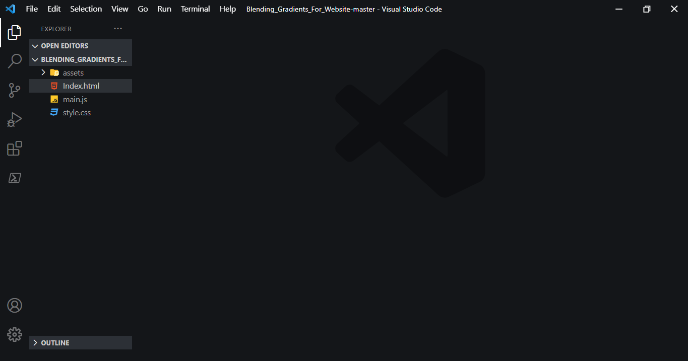
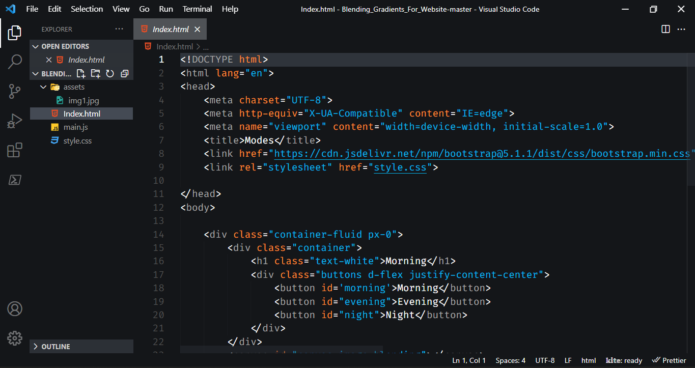
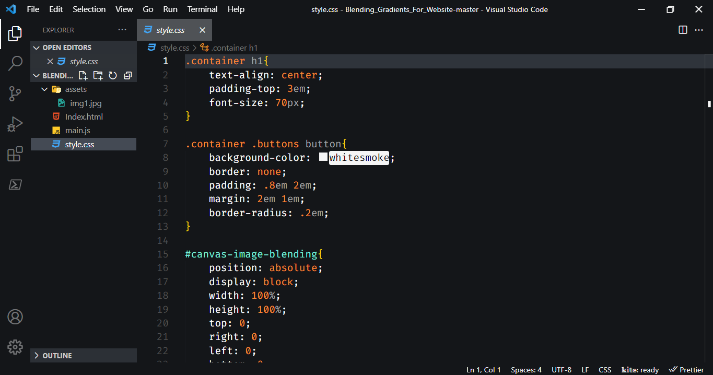
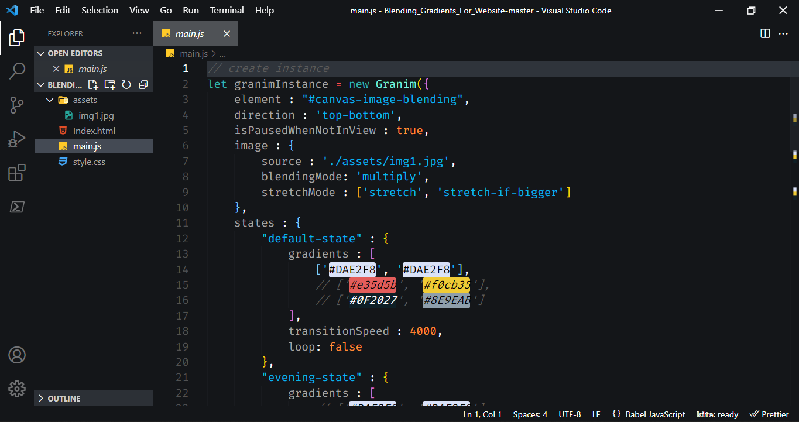

  

## Say Hi To the Best Theme Extension EVER

One of the most bothering things in VS CODE is the colour theme that you use for development...
May you download one and liked it but in small detail like the colour of variables, function name or even the colour of the sidebar, you decided to change it

so I tried to make my theme which is suitable 100% for me.
And I hope it will be suitable for you too

### Here, Some ScreenShots of this Extension View 
For : HTML , CSS and JAVASCRIPT

##### 1.Whole View

##### 2.HTML

##### 3.CSS

##### 4.JAVASCRIPT

### NOTE:
It is open source project,So you can download it from github at this link but don't forget to star and fork it😇:
>https://github.com/fadyehabamer/VSCode-Theme

At Last, hope you like the theme and Iam open for any feedback 

### Reach me on : 
> Facebook:
> www.facebook.com/fadyehabamer
>
> Twitter:
> www.twitter.com/fadyehabamer
>
> Github:
> www.github.com/fadyehabamer
>
> linked In:
> www.linkedin.com/in/fadyehabamer
